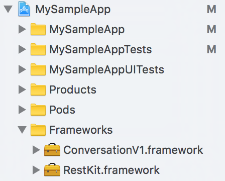
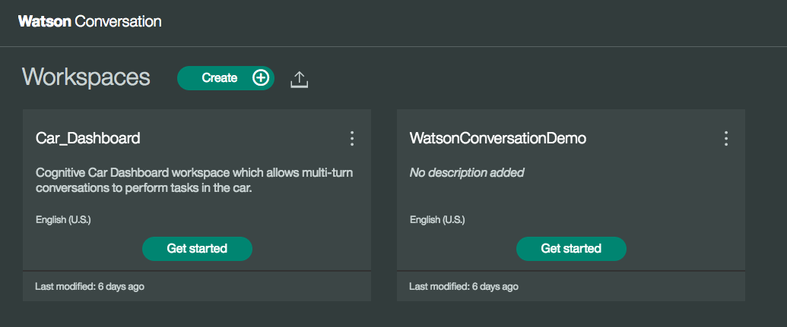
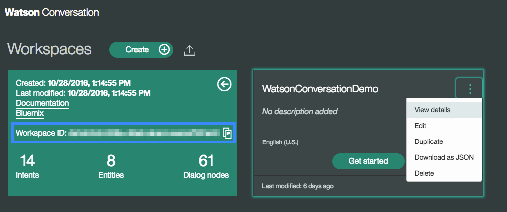

## Conversation
Bluemix Mobile Starter for Conversation in Swift

[](https://bluemix.net)
[](https://developer.apple.com/swift/)

### Table of Contents
* [Summary](#summary)
* [Requirements](#requirements)
* [Configuration](#configuration)
* [Run](#run)
* [License](#license)

### Summary
This Bluemix Mobile Starter will showcase the Conversation service from Watson and give you integration points for each of the Bluemix Mobile services.

### Requirements
* iOS 8.0+
* Xcode 8
* Swift 3.0

### Configuration
* [Bluemix Mobile services Dependency Mangagement](#bluemix-mobile-services-dependency-management)
* [Watson Dependency Management](#watson-dependency-management)
* [Watson Credential Mangement](#watson-credential-management)

#### Bluemix Mobile services Dependency Management
This starter uses the Bluemix Mobile services SDKs in order to use the functionality of Mobile Analytics, Push Notifications, and Mobile Client Access.

The Bluemix Mobile services SDK uses [CocoaPods](https://cocoapods.org/) to manage and configure dependencies. To use our latest SDKs you need version 1.1.0.rc.2.

You can install CocoaPods using the following command:

```bash
$ sudo gem install cocoapods --pre
```

If the CocoaPods repository is not confifgured, run the following command:

```bash
$ pod setup
```

For this starter, a pre-configured `Podfile` has been included in the **ios_swift/Podfile** location. To download and install the required dependencies, run the following command in the **ios_swift** directory:

```bash
$ pod install
```
Now Open the Xcode workspace: `{APP_Name}.xcworkspace`. From now on, open the `.xcworkspace` file becuase it contains all the dependencies and configurations.

If you run into any issues during the pod install, it is recommended to run a pod update by using the following commands:

```bash
$ pod update
$ pod install
```

> [View configuration](#configuration)

#### Watson Dependency Management
This starter uses the Watson Developer Cloud iOS SDK in order to use the Watson Conversation service.

The Watson Developer Cloud iOS SDK uses [Carthage](https://github.com/Carthage/Carthage) to manage dependencies and build binary frameworks.

You can install Carthage with [Homebrew](http://brew.sh/):

```bash
$ brew update
$ brew install carthage
```

To use the Watson Developer Cloud iOS SDK in any of your applications, specify it in your `Cartfile`:

```
github "watson-developer-cloud/ios-sdk"
```

For this starter, a pre-configured `Cartfile` has been included in the **ios_swift/Cartfile** location

Run the following command to build the dependencies and frameworks:

```bash
$ carthage update --platform iOS
```

> **Note**: You may have to run `carthage update --platform iOS --no-use-binaries`, if the binary is a lower version than your current version of Swift.

Once the build has completed, the frameworks can be found in the **ios_swift/Carthage/Build/iOS/** folder. The Xcode project in this starter already includes framework links to the following frameworks in this directory:

* **ConversationsV1.framework**
* **RestKit.framework**



If you build your Carthage frameworks in a separate folder, you will have to drag-and-drop the above frameworks into your project and link them in order to run this starter successfully.

> [View configuration](#configuration)

#### Watson Credential Management
Once the dependencies have been built and configured for the Bluemix Mobile service SDKs as well as the Watson Developer Cloud SDK, you will need to configure the Watson Conversation service. A Watson Conversation service on Bluemix has already been created for you, find it in your list of services.

You will need to create or upload a conversation file to your Watson Conversation service on Bluemix in order to allow proper interaction with the service.

In the dashboard of your Conversation service on Bluemix run the Conversation tooling dashboard by clicking the **Launch tool** button:


Now create your own Conversation Workspace or upload the sample we have included in this project (**bluemix_mobile_qa_workspace.json**):



After you have created or uploaded a Conversation Workspace you will need to get the Workspace Id. Click the **View details** list item to see the Workspace information. Save the **WorkspaceID** which we will need to include in our application configuration:



Navigate to **ViewController.swift** and replace the String `"YOUR_WORKSPACE_ID"` (approx. line ~53)with your Watson Conversation workspace id saved earlier.

The other unique credentials from your Watson Conversation service have already been injected into the application, so no further configuration is required.

> [View configuration](#configuration)

### Run
You can now run the application on a simulator or physical device:


The Watson Conversation service allows you to add a natural language interface to your application to automate interactions with your end users. This application shows an application of this service that allows you to have a conversation with Watson. Watson will send an initial conversation which you can then reply to and continue to interact with the service.

### License
This package contains code licensed under the Apache License, Version 2.0 (the "License"). You may obtain a copy of the License at http://www.apache.org/licenses/LICENSE-2.0 and may also view the License in the LICENSE file within this package.
